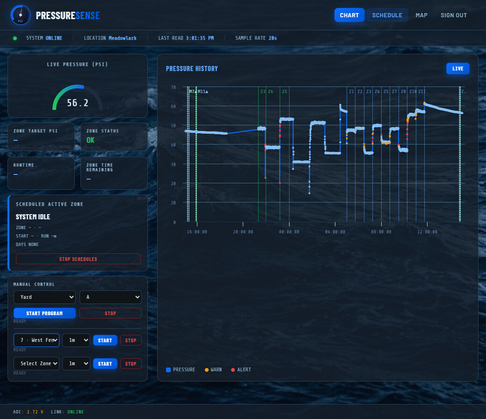
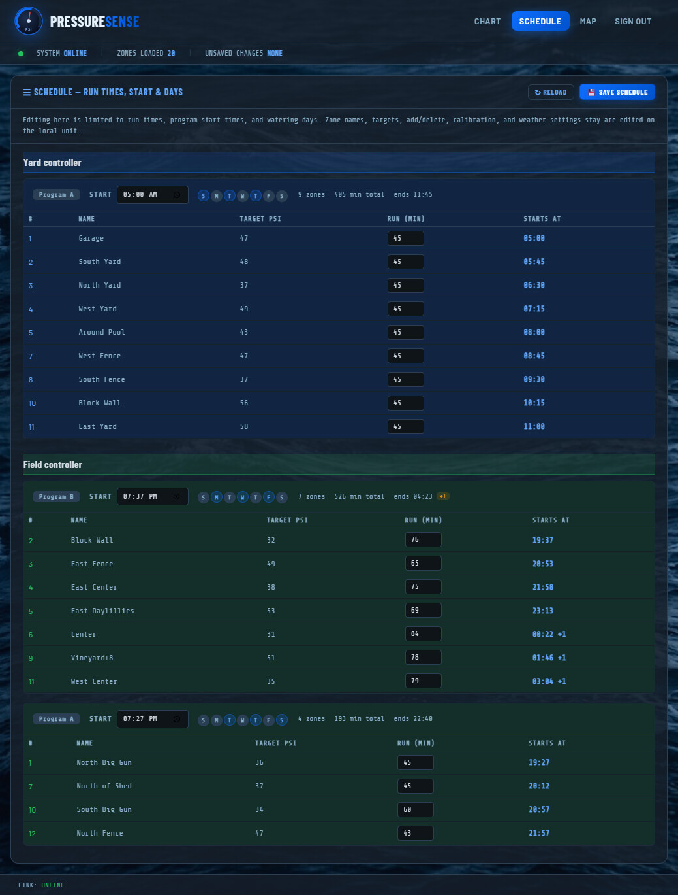
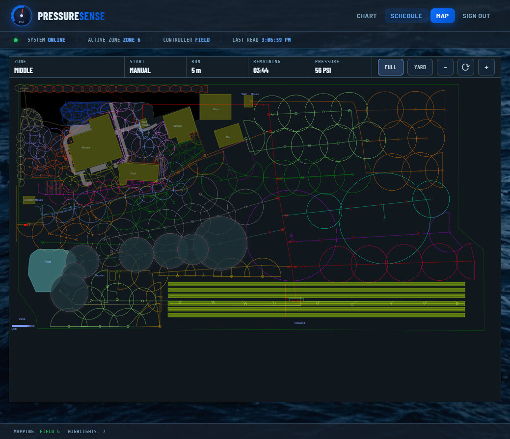

# PressureSense App

PressureSense App is a Cloudflare Worker that exposes the [PressureSense](../PressureSense_Master) irrigation pressure-monitoring system to the public internet. It's a thin mirror of the master controller's own local web UI — live pressure chart with history, a limited schedule editor with a read-only Weather & Auto-Adjust panel, manual zone/program control, a live sprinkler zone map, and a small photo gallery — reachable from anywhere, without exposing the master controller itself to the internet. Viewing every page is public; a shared password is only required to actually change something (manual zone/program start or stop, saving the schedule, pausing/resuming scheduled watering).

## System overview

- **PressureSense_Master (master, separate repo)** — the scheduler and LoRa master. Reads the pressure sensor, runs the zone schedule, commands the Yard/Field relay boards, and serves its own local web UI + a `/ws` WebSocket feed of live sensor/config/manual-run data.
- **PressureSense Indoor (separate repo)** — a WiFi-local touchscreen client of the master's `/ws` feed.
- **PressureSense App (this repo)** — a Cloudflare Worker + Durable Object that relays that same `/ws` feed to the public internet. It never talks to the master directly; the **Indoor unit** acts as the bridge, holding one outbound connection to the master's local `/ws` and one outbound connection to this Worker's `/device` endpoint, forwarding frames in both directions. This repo has no code running on the master or the Indoor unit — it's purely the cloud side.

```
Browser  <--wss-->  Cloudflare Worker (this repo)  <--wss-->  Indoor unit  <--ws-->  Master
                     (Durable Object: fan-out + SQLite history)
```

## Architecture

`src/index.js` is the entire Worker:

- **`export default { fetch }`** — a plain router: `/device` (the Indoor unit's socket, gated by a `RELAY_TOKEN` bearer header), `/login` (password → signed session cookie, HMAC-SHA256 over an expiry timestamp, no server-side session storage), `/api/command` (gated by that session cookie; the only way a mutating command reaches the device), `/ws` (the browser's socket — public, but will only forward/answer read-only commands), `/` and everything else served from `public/` as static assets, all public.
- **`PressureSenseRelay` (Durable Object, SQLite-backed)** — holds one device socket and a `Set` of browser sockets in memory, fans out every frame from the device to every browser, and forwards a browser's read-only WS commands or a `/api/command` caller's already-cookie-verified mutating command on to the device via its `forwardCommand` RPC method (which independently re-checks the mutating-command allow-list). It is **not** a general-purpose message parser — the only messages it looks inside are:
  - `sensorUpdate` — recorded into a `history` SQLite table (`ts, psi, zoneAvgPsi, zoneNumber, controller, allOff`), pruned to a rolling 24h window on every insert. `allOff` is stored but not used for active-zone logic — see [Design notes](#design-notes).
  - `manualZoneStatus` — diffed against the previous run list to record discrete `manual_events` (`ts, relay, controller, kind: 'start'|'stop'`), also pruned to 24h.
  - `getHistory` (a browser-only command, never forwarded to the device) — answered directly from those two tables, so a newly-connecting browser can backfill its chart and zone/manual markers without waiting on live traffic, and without ever touching the master.

This design exists because the relay has **no path to the master except through the Indoor unit's WebSocket relay** — there is no HTTP route from Cloudflare to the master, so anything the dashboard needs (history, zone markers) either has to already be flowing through that one WebSocket, or be recorded here as it passes through. See [Design notes](#design-notes) below for what that rules out.

## Web UI

Four pages share `public/style.css` (ported from the master's own stylesheet — no longer byte-identical, since App-only additions like the PHOTOS gallery and some mobile-nav tweaks have diverged, but the shared color palette/fonts/card conventions still match):

| Page | Files | Purpose |
| --- | --- | --- |
| CHART | `index.html` / `dashboard.js` | Live pressure gauge, OK/WARN/HIGH/LOW status badge, active-zone card (scheduled *or* manual — a manual run takes over the card entirely rather than sitting in a separate panel), manual zone/program start-stop, a Runtime stat that shows "Wx Adj xx% / Deficit xx.x mm" underneath the active zone's minutes whenever weather auto-adjust is on, a zoomable/pannable Highcharts pressure history chart backfilled from the Worker's own 24h SQLite history, with dashed vertical zone-change and manual start/stop markers |
| SCHEDULE | `schedule.html` / `schedule.js` / `weather-panel.js` | Limited remote schedule editor — run times, program start times, and watering days only (zone names, targets, add/delete, and calibration stay master-local by design), plus a read-only "Weather & Auto-Adjust" panel (per-controller tiles + Chart.js deficit chart, ported from the master's CONFIG page) and WX Run/Deficit columns + a RAIN SKIP badge in the schedule table itself. Weather *settings* are still edited only on the master — this page only displays what they're currently doing |
| MAP | `map.html` / `map.js` | Inline SVG sprinkler layout, ported from the master's own MAP page; highlights whichever zone(s) are currently active (scheduled and/or manual, simultaneously), with pan/zoom and a full/yard view toggle. Strictly read-only — sends no commands |
| PHOTOS | `photos.html` / `photos.js` | Static photo gallery with a description under each image — a plain `{file, description}` array in `photos.js`, no server round trip. No live data, no WebSocket |

CHART/SCHEDULE/MAP each open their own independent WebSocket to `/ws` (no shared connection module), each with its own 3s auto-reconnect. PHOTOS doesn't connect at all.

### Screenshots

**CHART**


**SCHEDULE**


**MAP**


## WebSocket protocol (summary)

Message shapes match the master's own `build*Json()` functions verbatim — the Worker relays them byte-for-byte, so field names here are exactly what the master sends.

| Direction | Message / command | Purpose |
| --- | --- | --- |
| Master → browser | `sensorUpdate` | Live PSI, active zone/controller/schedule fields, plus `weatherAutoAdjustEnabled`/`weatherAdjustPct`/`deficitMm` for the active zone — same cadence as the master's sample rate |
| Master → browser | `manualZoneStatus` | Active manual zone/program runs (`controller`, `relay`, `remainingSec`, `totalRunMinutes`, `program`, `programLetter`, `weatherAdjustPct`, `deficitMm`), plus a top-level `weatherAutoAdjustEnabled` flag |
| Master → browser | `schedule` | `controllers.json` contents — requested via `getSchedule`, used to populate the manual-zone dropdowns and schedule editor |
| Master → browser | `schedulesEnabled` | Pause/resume state |
| Master → browser | `weatherState` / `weatherLog` / `weatherCache` / `calibration` / `weatherSettings` | Weather & Auto-Adjust panel data for the SCHEDULE page (`weather-panel.js`) — same shapes as the master's `/weather-state`, `/weather_log.json`, `/weather_cache.json`, `/calibration.json` HTTP endpoints, plus a narrow read-only slice of `site.json`'s `weather` block for `weatherSettings`. Requested once on connect via `getWeatherState`/`getWeatherLog`/`getWeatherCache`/`getCalibration`/`getWeatherSettings` |
| Master → browser | `ack` / `manualZoneAck` / `manualProgramAck` | Command success/failure + message |
| **Worker (not master) → browser** | `history` | `{ points: [...], manualEvents: [...] }` from the Durable Object's own SQLite tables — answers `getHistory`, never touches the master |
| Browser → master, via public `/ws` (relayed) | `getSchedule`, `getSchedulesEnabled`, `getWeatherState`, `getWeatherLog`, `getWeatherCache`, `getCalibration`, `getWeatherSettings` | Read-only; no password required |
| Browser → master, via cookie-gated `POST /api/command` (relayed) | `saveSchedule`, `setSchedulesEnabled` | Schedule write, pause/resume |
| Browser → master, via cookie-gated `POST /api/command` (relayed) | `manualZone`, `manualProgram` | Start/stop a manual zone or lettered program; `manualProgram` also takes `action: 'next'` to skip a running program straight to its next zone (or stop it, if the current zone is the last one) |
| **Browser → Worker (not relayed)** | `getHistory` | Answered locally by the Durable Object; the master never sees this command |

The Indoor unit enforces its own allow-list on which commands from the relay are permitted to reach the master (`getSchedule`, `saveSchedule`, `getSchedulesEnabled`, `setSchedulesEnabled`, `manualZone`, `manualProgram`, `getWeatherState`, `getWeatherLog`, `getWeatherCache`, `getCalibration`, `getWeatherSettings`) — everything else from a remote browser is dropped there, not here.

## Design notes

A few deliberate departures from the master's own behavior, worth knowing before extending this further:

- **Rolling 24h window, not a calendar day.** The master's own chart resets at local midnight to a new day's file. This Worker has no server-local timezone concept and the Durable Object never stops running, so instead of a day boundary it keeps a rolling last-24h window (SQLite `DELETE WHERE ts < now - 24h`), which avoids an always-thin chart right after midnight but means "today" isn't a meaningful boundary here.
- **Zone-change markers are live-observed, not schedule-precomputed.** The master's chart precomputes a whole day's scheduled start times from `controllers.json` + weather-adjustment state. The CHART page doesn't do that same precomputation (it never fetches `weatherState`/`weatherSettings` — only the SCHEDULE page's `weather-panel.js` does, for a different feature entirely), so markers are instead drawn the moment an actual zone/controller change is *observed* in `sensorUpdate`/`manualZoneStatus` traffic, and recorded server-side so they survive reconnects. This means markers only exist from whenever this feature shipped onward, and only for periods the Indoor unit's relay link was actually up.
- **History has no pre-existing backfill.** The Durable Object's SQLite tables start empty at first deploy and grow from there — there's no way to pull the master's own (much larger, HTTP-only) daily CSV log through the WebSocket relay to seed it retroactively; that data is ~100KB+/day, too large and too risky to push through the Indoor unit's constrained embedded WebSocket hop.
- **Manual-run visual precedence differs by page.** The CHART page's active-zone card lets a manual run fully replace the scheduled-zone display (matching the Indoor unit's LVGL screen). The MAP page instead highlights *both* simultaneously, matching the master's own MAP page behavior exactly.
- **`allOff` is recorded but never used for active-zone detection.** It's the master's own pressure-recovery heuristic (`currentPressure >= ZONES_ALL_OFF_PSI`, 59 PSI) — on this system's pressure-tank setup, a refill snaps to ~62 PSI and takes *hours* to decay back down, so `allOff` reads "not idle" for most of a normal idle cycle and "idle" for a while right after a zone genuinely starts. `zoneNumber`/`controller` alone drive every active-zone check here (the history INSERT in `src/index.js`, and `dashboard.js`'s runtime stats, active-zone card, and chart zone markers) — this was an actual bug (flashed "SYSTEM IDLE" right as zones started, delayed zone markers) until it was found and fixed by auditing all four PressureSense repos for the same `allOff` dependency the Indoor/Master fix traced back to. Don't reintroduce an `allOff` check into any of those.

## Project structure

```
src/index.js               The entire Worker: router + PressureSenseRelay Durable Object
public/index.html          CHART page markup
public/dashboard.js        CHART page logic: gauge, chart, manual controls, zone markers
public/schedule.html       SCHEDULE page markup
public/schedule.js         SCHEDULE page logic: run/start/day editing, save/reload, requests the
                           weather-panel.js data over /ws
public/weather-panel.js    Weather & Auto-Adjust panel (tiles + Chart.js deficit chart) for the
                           SCHEDULE page -- close port of the master's config.js, adapted to read
                           WS-delivered data instead of fetch()
public/map.html            MAP page markup
public/map.js              MAP page logic: SVG load, zone highlighting, zoom/pan
public/photos.html         PHOTOS page markup
public/photos.js           PHOTOS page logic: static {file, description} array -> grid, no
                           WebSocket
public/photos/             Web-optimized photos served by the PHOTOS page (originals live in the
                           repo-root photos/ folder, git-ignored -- see photos.js for the resize
                           workflow)
public/sprinklers_map.svg  Sprinkler layout vector art (copied from the master's own asset)
public/zone_mappings.txt   SVG layer name -> controller/zone-number mapping (copied from master)
public/auth-modal.js       Password-prompt modal + sendGatedCommand() helper for mutating actions
public/style.css           Shared stylesheet -- ported from the master's own style.css (see Web UI
                           above; no longer byte-identical)
public/zone-utils.js       Shared schedule math (derived start/end times, overlap detection,
                           weather-adjustment math), ported from the master, used by schedule.js
                           and weather-panel.js
test/index.spec.js         Vitest + @cloudflare/vitest-pool-workers tests against a real workerd runtime
wrangler.jsonc             Worker config: static assets binding, Durable Object + SQLite migration
image/                     README screenshots (CHART, SCHEDULE, MAP pages)
```

## Getting started

1. **Secrets** (set once via `wrangler secret put <NAME>`, not committed anywhere):
   - `RELAY_TOKEN` — bearer token the Indoor unit presents to authenticate its `/device` connection.
   - `DASHBOARD_PASSWORD` — the single shared password for `/login`, required only to perform a mutating action (manual zone/program control, saving the schedule, pausing/resuming schedules); viewing every page is public.
   - `SESSION_KEY` — HMAC signing key for session cookies.
2. **Local development**:
   ```
   npm run dev
   ```
   The active Wrangler project name is `pressuresense-app`, so a fresh deploy will publish under that name unless you override it in `wrangler.jsonc`.
3. **Run tests**:
   ```
   npm test
   ```
4. **Deploy**:
   ```
   npm run deploy
   ```
5. Point the Indoor unit's `RELAY_HOST`/`RELAY_PORT`/`RELAY_PATH`/`RELAY_TOKEN` (in its own `main.cpp`) at this Worker's deployed URL.
